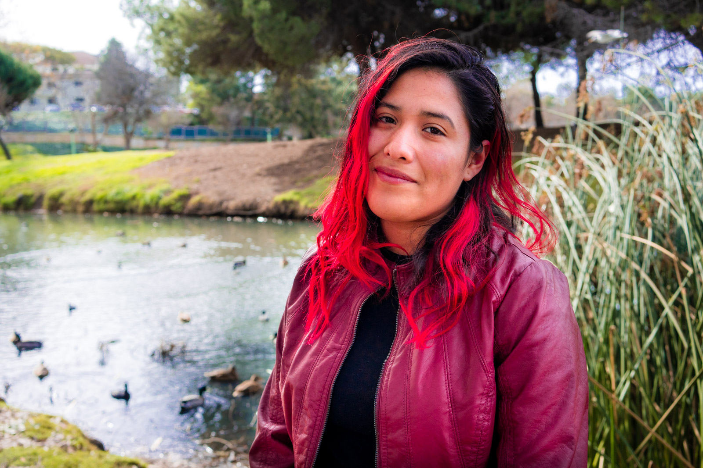

# Hi I am Rosemary Juarez.

As a current rising Junior at ucsb, I am working on making sure I keep on my track to working on coding, to learn a new skill that can enhance my experience as a geography major. I am currently working at a fast food restaurant and babysitting my nephews. In my free time I like to sit outside in my yard and relax. I am excited to take internships once I return to UCSB and hopefully my experience with this class can help me with any future potential internships. 

